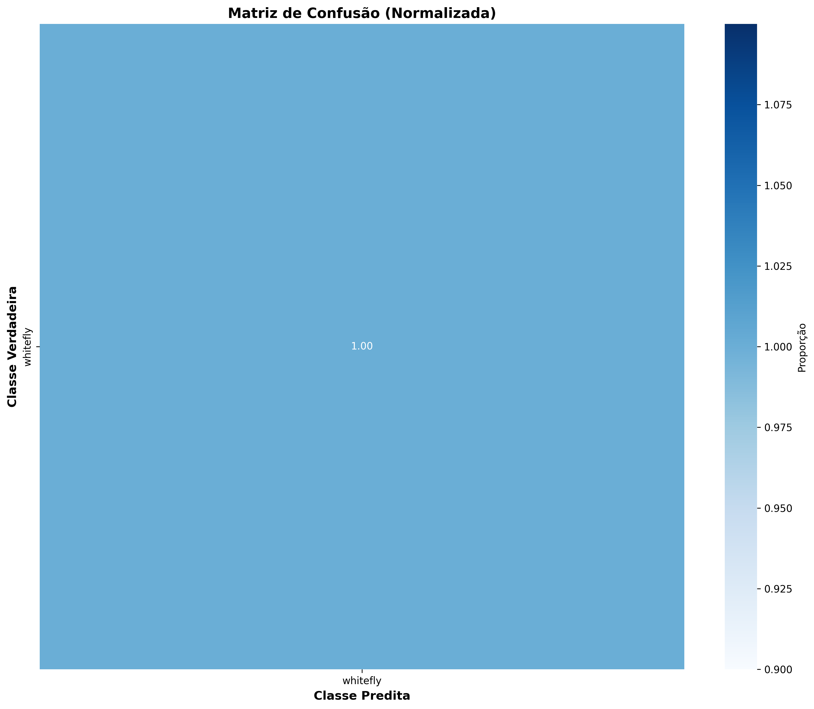

# 🍅 Detecção de Mosca-Branca (*Trialeurodes vaporariorum*) com YOLOv8

> Um sistema de Visão Computacional otimizado para a detecção de pequenos insetos em armadilhas adesivas em cultivos de tomate.


## 📋 Sobre o Projeto

Este repositório contém o código-fonte e a metodologia desenvolvida para o monitoramento automatizado da **Mosca-Branca-de-Estufa** (*Trialeurodes vaporariorum*), um vetor viral crítico na tomaticultura da região de Mogi Guaçu/SP.

O projeto foca na engenharia de dados e otimização de hiperparâmetros da arquitetura **YOLOv8s** (Small) para detectar objetos minúsculos (1-2mm) em cenários de alta densidade, superando as limitações da contagem manual em armadilhas cromotrópicas.

---

## 🚀 Principais Funcionalidades

* **Pipeline de Anotação Híbrida:**
    * `auto_label.py`: Algoritmo de pré-anotação baseado em visão clássica (CLAHE + Segmentação HSV + Canny).
    * `manual_label.py`: Ferramenta interativa para refinamento humano (*Human-in-the-loop*).
* **Treinamento Otimizado:** Configuração customizada para estabilidade (AdamW, 512px) e preservação de pequenos objetos (Mosaic=0.0).
* **Validação Abrangente:** Geração automática de métricas COCO, Matriz de Confusão e Benchmark de velocidade.

---

## 📊 Resultados Obtidos

O modelo alcançou desempenho robusto no conjunto de teste isolado, viabilizando o uso em tempo real.

| Métrica | Valor | Descrição |
| :--- | :--- | :--- |
| **Precisão** | **89.61%** | Alta confiabilidade nas detecções positivas |
| **Recall** | 67.93% | Capacidade de detecção em cenários complexos |
| **mAP@0.5** | 75.46% | Equilíbrio geral do modelo |
| **Velocidade** | **13.98 ms** | ~71 FPS (GPU), apto para tempo real |

### Visualização das Detecções
O modelo demonstra capacidade de identificar desde indivíduos isolados até grandes aglomerados.

<p align="center">
  
  
  
</p>

### Métricas de Validação
<p align="center">
  
  
</p>

---

## 📂 Estrutura do Repositório

```text
.
├── auto_label.py             # Script de pré-anotação automática (HSV/Canny)
├── manual_label.py           # Ferramenta GUI para revisão das labels
├── model_trainer.py          # Wrapper de treinamento YOLO otimizado
├── test_validation_model.py  # Suite de testes, métricas e gráficos
├── requirements.txt          # Dependências do projeto
└── README.md
````

-----

## 🛠️ Instalação

1.  **Clone o repositório:**

    ```bash
    git clone [https://github.com/seu-usuario/nome-do-repo.git](https://github.com/seu-usuario/nome-do-repo.git)
    cd nome-do-repo
    ```

2.  **Instale as dependências:**

    ```bash
    pip install ultralytics opencv-python pandas seaborn matplotlib tqdm pyyaml
    ```

3.  **Dataset:**
    Este projeto utiliza um subconjunto filtrado do dataset [IP102](https://github.com/xpwu95/IP102). Certifique-se de ter as imagens organizadas conforme estrutura YOLO.

-----

## ⚙️ Como Usar

### 1\. Preparação dos Dados (Opcional)

Se você tem imagens brutas e precisa anotar:

```bash
# Gera labels preliminares baseadas em cor e forma
python auto_label.py --dataset ./caminho/do/dataset --conf 0.55

# Abre a interface gráfica para corrigir as labels
python manual_label.py
```

### 2\. Treinamento do Modelo

Inicia o treinamento com os hiperparâmetros otimizados (AdamW, 512px, 200 épocas):

```bash
python model_trainer.py
```

*O script verificará a integridade do dataset e criará backups das labels automaticamente antes de iniciar.*

### 3\. Validação e Teste

Gera relatórios HTML, matriz de confusão e imagens com predições:

```bash
python test_validation_model.py
```

-----

## 🧠 Detalhes Técnicos

  * **Arquitetura:** YOLOv8s (Small)
  * **Resolução de Entrada:** 512x512 pixels
  * **Otimizador:** AdamW (`lr0=0.001`)
  * **Data Augmentation:**
      * Mosaic: 0.0 (Desativado para preservar escala)
      * Rotação: +/- 10°
      * HSV: Ajustes leves
  * **Hardware de Treino:** NVIDIA GPU (Suporte a CUDA ativado)

-----

**Autor:** Victor Augusto de Oliveira
*Engenharia de Computação - FHO*
